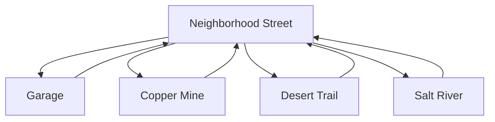

# BikeBrowserWorld Master Engineering Dossier

## Current State Of The Game

BikeBrowserWorld is a Godot 4.6 2D adventure/education prototype. It now boots to `res://Regions/Neighborhood/NeighborhoodStreet.tscn` and has a region-based world with neighborhood, garage, mine, desert, river, and system showcase scenes. The codebase also contains a large ecosystem of generated addons and tools from Projects 1-20.

## What Actually Works

- Main scene points at the current neighborhood.
- Player, NPCs, props, HUD, and transition zones exist in region scenes.
- RegionRegistry can transition between registered scenes.
- Dialogue requests are routed through EventBus.
- QuestRegistry can run the two registered quests: `chain_repair, flat_tire_repair`.
- Music assets exist and AudioService can play native MP3 streams.

## What Is Partially Working

- Many quests exist as JSON but are not registered.
- Dialogue data exists in multiple schemas.
- Save, inventory, achievement, localization, and camera systems exist in duplicate/generated forms.
- TTS is implemented but platform-dependent.
- Educational data is broad but not consistently surfaced in live gameplay.

## What Is Placeholder

- Some region environments use blockout geometry.
- Some addons are showcase-only.
- NPC schedules and several educational systems are data-only.
- Generated Projects 1-20 are present but not all integrated into the boot gameplay loop.

## What Is Missing

- One canonical save/dialogue/quest/inventory/achievement architecture.
- Dynamic mission loading and validation.
- Unified dialogue schema.
- A tested first-15-minute quest chain.
- Startup validators for missing resources, dialogue IDs, quest IDs, spawn anchors, and audio tracks.

## Most Important Systems

1. EventBus
2. RegionRegistry
3. ZuzuController
4. DialogueManager + DialogController
5. QuestRegistry + RewardBridge
6. SaveService
7. AudioService
8. LayoutApplier

## Most Fragile Systems

- DialogueManager class/autoload collision.
- Quest registry hardcoded path list.
- Duplicate generated runtime managers.
- Audio/TTS platform behavior.
- Save restoration path.

## Highest Priority Fixes

1. Choose canonical runtime systems and demote duplicates to library/demo status.
2. Convert QuestRegistry to folder-driven validated loading.
3. Normalize dialogue JSON to one schema.
4. Build the first 15-minute loop around Mrs. Ramirez, Mr. Chen, chain repair, garage repair, and one reward.
5. Add startup validation reports inside Godot.

## Recommended World Structure

## Recommended Region Hierarchy

Root `RegionScene` with child layers: Background, Ground, PropsBack, NPCs, Player, PropsFront, Transitions, Camera, UI.

## Recommended Save Architecture

Use `Core/SaveService` as canonical. Treat generated SaveManager as a reusable library until intentionally integrated. Add apply/deserialize methods for all saved subsystem payloads.

## Recommended Quest Architecture

Load all mission JSON from `Data/missions`, validate against a schema, enforce prerequisites/unlocks/next-chain, and emit errors for unreachable quests.

## Recommended NPC Architecture

Use a single NPC contract: `npc_id`, `display_name`, `dialogue_id`, `quest_hooks`, `interaction_radius`, `schedule_id`. Validate dialogue and quest hooks at startup.

## Recommended Audio Architecture

Keep `AudioService` canonical. Add complete region-to-track mapping, a visible audio debug/test scene, and graceful fallback when native TTS is unavailable.

## Recommended Gameplay Loop

Neighborhood exploration -> Mrs. Ramirez safety check -> Mr. Chen chain repair -> garage repair interaction -> reward/badge -> choose next region.
