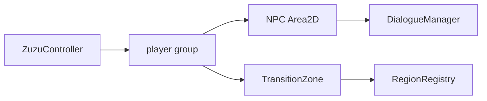

# Player Controller Audit

Primary script: `Systems/World/ZuzuController.gd`

## Findings

- IMPLEMENTED: A dedicated player controller exists and is referenced by playable region scenes.
- IMPLEMENTED: NPC and transition systems depend on the player being in group `player`.
- PARTIALLY IMPLEMENTED: Camera behavior is scene-local; generated camera runtime exists but is not clearly the canonical active camera system.
- PARTIALLY IMPLEMENTED: Quest, inventory, and save integration are indirect through interactions and autoloads, not owned by a full player state machine.
- NEEDS MANUAL PROFILING: Movement feel, diagonal speed, jitter, and collision quality require running the native Godot window.

