# Quest Flow Map

```mermaid
flowchart TD
  algae_bloom_source["algae_bloom_source"]
  bike_safety_check["bike_safety_check"]
  bridge_material_test["bridge_material_test"]
  bridge_quest_1["bridge_quest_1"]
  bridge_quest_2["bridge_quest_2"]
  bridge_quest_3["bridge_quest_3"]
  bridge_quest_4["bridge_quest_4"]
  bridge_quest_5["bridge_quest_5"]
  chain_repair["chain_repair"]
  copper_rock_id["copper_rock_id"]
  desert_plant_observation["desert_plant_observation"]
  first_safety_check["first_safety_check"]
  flat_tire_repair["flat_tire_repair"]
  mine_cart_repair["mine_cart_repair"]
  test_water_quality["test_water_quality"]
  track_the_animal["track_the_animal"]
  water_sample_observation["water_sample_observation"]
  workshop_first_build["workshop_first_build"]
```

Solid arrows are unlock/next relationships. Dotted arrows are prerequisites. Runtime availability is currently narrower than the graph because only `chain_repair, flat_tire_repair` are registered.
