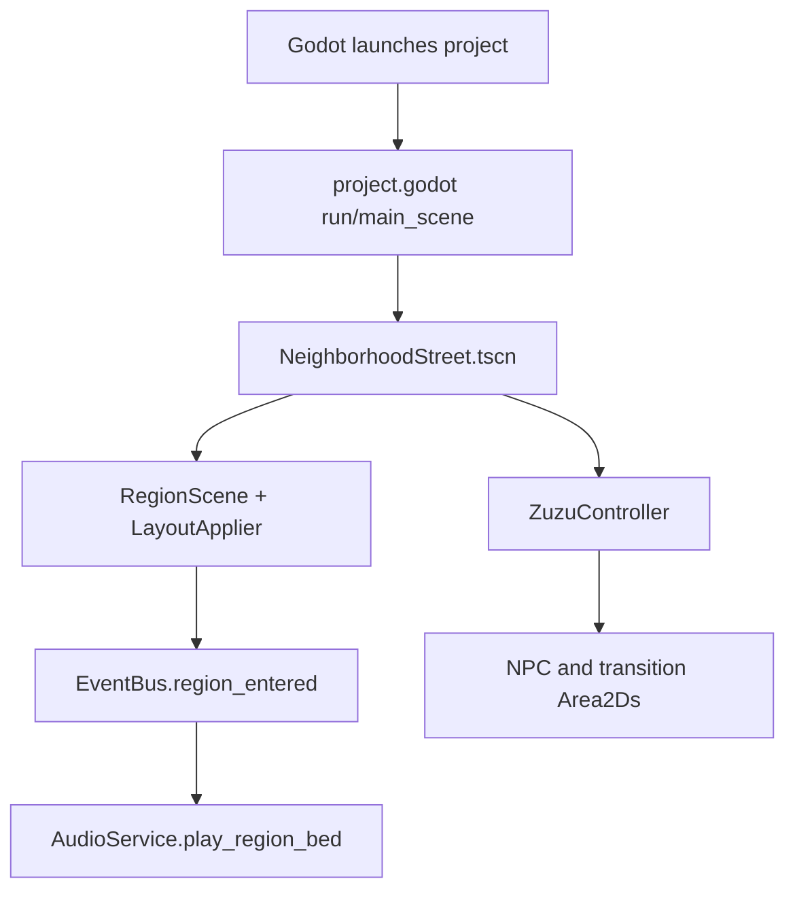
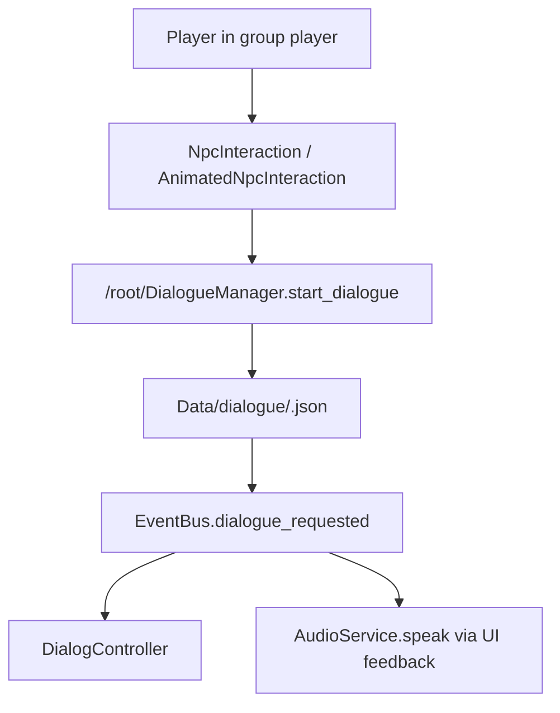
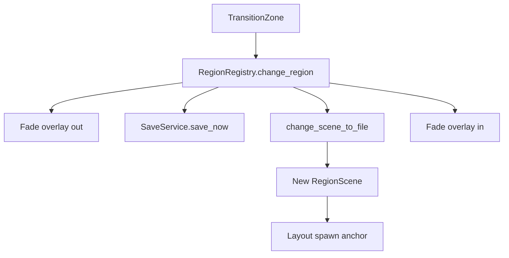

# Runtime Architecture Audit

## Autoloads

| Singleton | Path | Exists |
| --- | --- | --- |
| EventBus | res://Core/EventBus/EventBus.gd | yes |
| SaveService | res://Core/SaveService/SaveService.gd | yes |
| RegionRegistry | res://Core/RegionRegistry/RegionRegistry.gd | yes |
| QuestRegistry | res://Core/QuestRegistry/QuestRegistry.gd | yes |
| DiscoveryService | res://Core/DiscoveryService/DiscoveryService.gd | yes |
| InventoryManager | res://Core/InventoryManager/InventoryManager.gd | yes |
| DialogueManager | res://Core/DialogueManager/DialogueManager.gd | yes |
| CompanionBridge | res://Core/CompanionBridge/CompanionBridge.gd | yes |
| RewardBridge | res://Core/RewardBridge/RewardBridge.gd | yes |
| AudioService | res://Core/AudioService/AudioService.gd | yes |
| NameGeneratorRuntime | res://addons/NameGenerator/name_generator.gd | yes |
| QuestGeneratorRuntime | res://addons/ProceduralQuest/quest_generator.gd | yes |
| CraftingManagerRuntime | res://addons/InventorySystem/crafting.gd | yes |
| SaveManagerRuntime | res://SaveSystem/SaveManager.gd | yes |
| CameraControllerRuntime | res://CameraSystem/CameraController.gd | yes |
| EffectManagerRuntime | res://EffectPool/EffectManager.gd | yes |
| TranslationManagerRuntime | res://Localization/TranslationManager.gd | yes |
| AchievementManagerRuntime | res://AchievementSystem/AchievementManager.gd | yes |
| ProjectIntegration | res://Core/ProjectIntegration/ProjectIntegration.gd | yes |

## Addon Plugin Files

| Plugin | plugin.cfg | Script | Status |
| --- | --- | --- | --- |
| Aseprite Wizard | addons/AsepriteWizard/plugin.cfg | plugin.gd | installed/disabled |
| DialogueSystem | addons/DialogueSystem/plugin.cfg | dialogue_system_plugin.gd | installed/disabled |
| InventorySystem | addons/InventorySystem/plugin.cfg | inventory_system_plugin.gd | installed/disabled |
| NameGenerator | addons/NameGenerator/plugin.cfg | name_generator_plugin.gd | installed/disabled |
| Aseprite Importers | addons/nklbdev.aseprite_importers/plugin.cfg | editor_plugin.gd | installed/disabled |
| Importality | addons/nklbdev.importality/plugin.cfg | editor_plugin.gd | enabled |
| ProceduralQuest | addons/ProceduralQuest/plugin.cfg | procedural_quest_plugin.gd | installed/disabled |
| ReusableUI | addons/ReusableUI/plugin.cfg | scripts/reusable_ui_plugin.gd | installed/disabled |
| TerrainGenerator | addons/TerrainGenerator/plugin.cfg | TerrainGeneratorPlugin.gd | installed/disabled |

## Startup Flow

## Interaction Flow

## Region Loading Flow

## Architecture Findings

- IMPLEMENTED: Autoload-driven runtime architecture exists and the main scene points to the current neighborhood world.
- IMPLEMENTED: EventBus is the main signal hub.
- PARTIALLY IMPLEMENTED: Region transition, save, dialogue, quest, reward, and audio flows are present but not fully unified with generated addon systems.
- RISK: Addon classes can shadow autoload names, especially `DialogueManager`.
