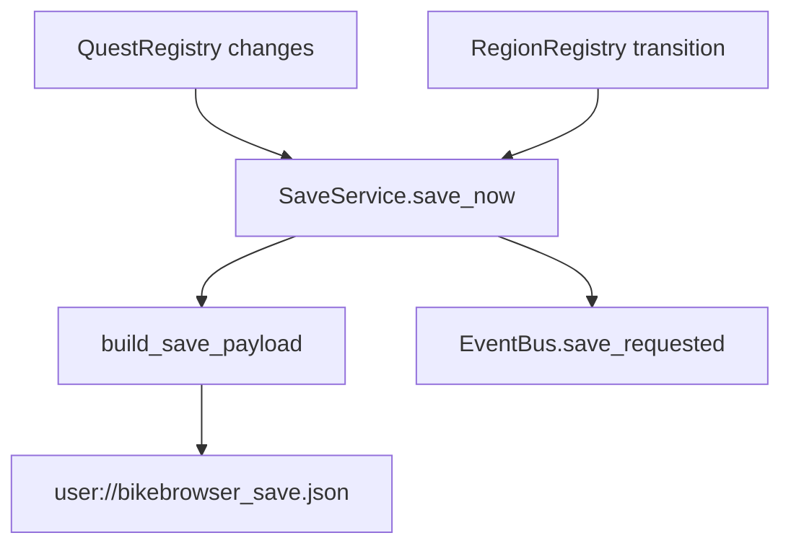

# Save System Audit

## Save Systems Present

- `Core/SaveService/SaveService.gd`: live autoload used by quests/regions.
- `SaveSystem/SaveManager.gd`: generated reusable save-slot manager, autoloaded as `SaveManagerRuntime`.
- `SaveSystem/AutoSaveManager.gd`: generated autosave helper.
- `SaveSystem/CloudSyncAdapter.gd`: generated cloud sync scaffold.

## Live Save Flow

## Findings

- IMPLEMENTED: SaveService serializes current region/spawn, regions, quests, discovery, inventory, timestamp, and player stub data.
- PARTIALLY IMPLEMENTED: Correct reload depends on every subsystem having an apply/deserialize path; static audit did not confirm full load-on-boot restoration.
- RISK: Two save systems can diverge unless one is made canonical.
