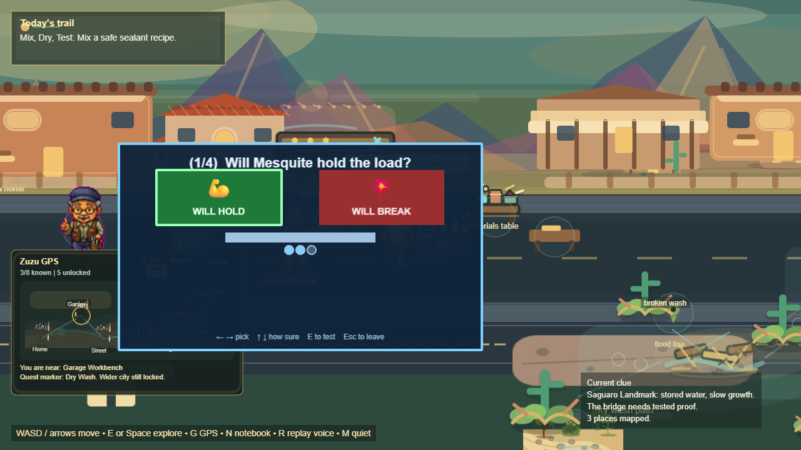
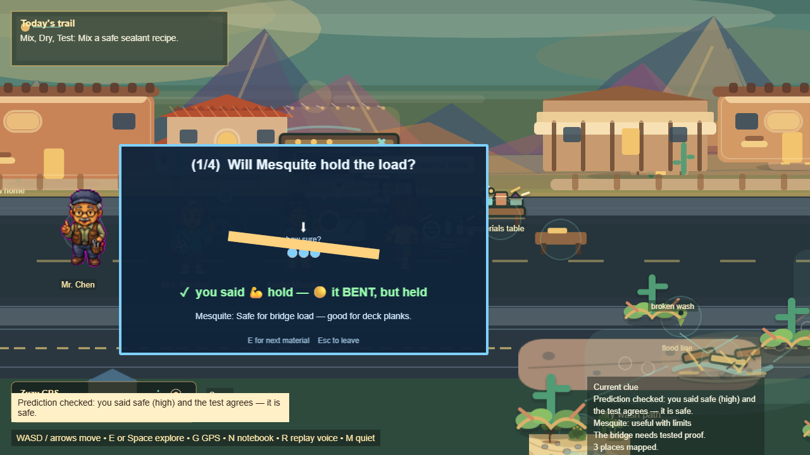
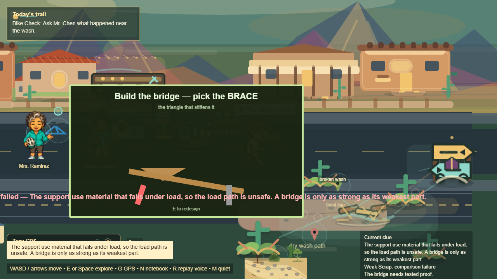
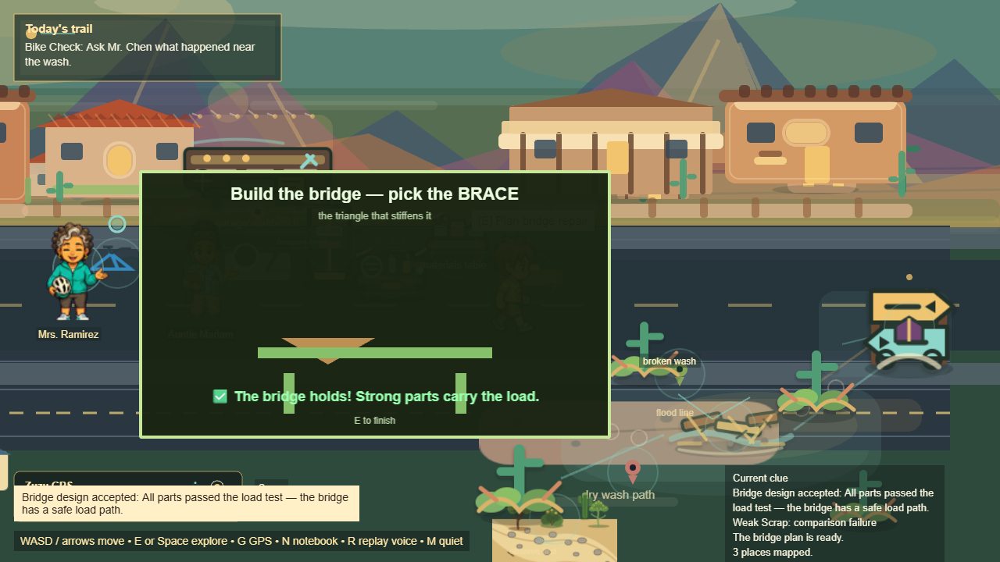
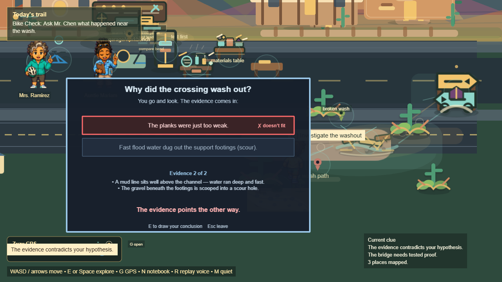
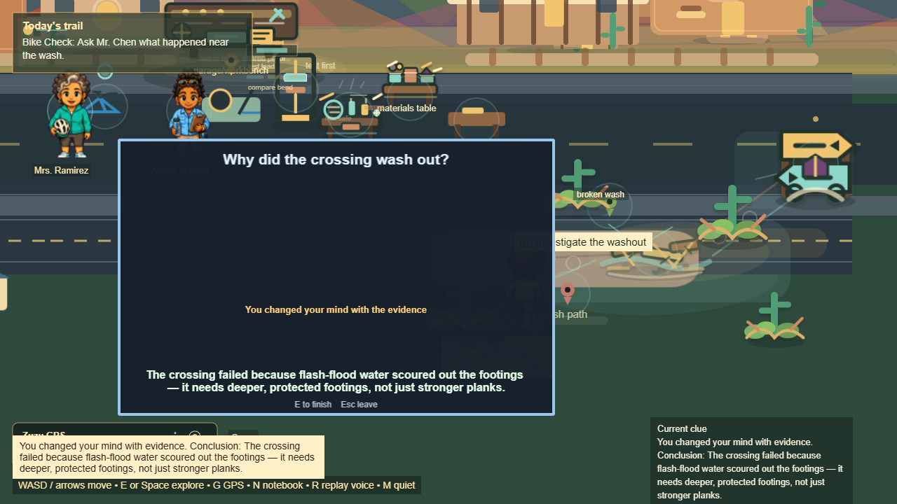
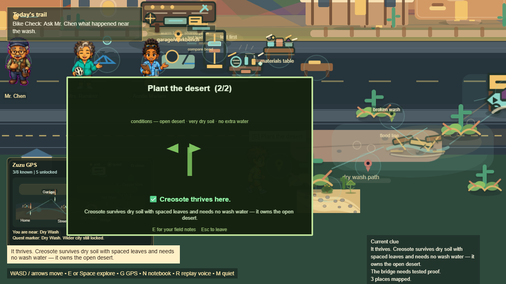

# Phase 1 — Completion Verification

**Date:** 2026-06-02
**Build under test:** `/game-rebuild` (canonical Act 1 runtime; React `GameShell` → Phaser)
**Principle:** *Implemented + Accepted ≠ Player Reachable.* Runtime truth wins. A system counts as done only when a real player can do it by keyboard/mouse and the loop delivers **choice → consequence → payoff**.

This document is the authoritative completion record for Phase 1 (incl. the 1.9
Player Reachability Sprint and the final reachability cleanup). All results below
come from a single fresh run of the three suites.

---

## 0. Verification runs (this report — fresh, one invocation)

| Suite | Spec(s) | Result |
|---|---|---|
| **Engine Acceptance** | `game-rebuild.act1-acceptance.spec.js` | ✅ 1 passed (1.7m) — full Act 1 walkthrough by keyboard/visible prompts |
| **Reconciliation Suite** | `phase1-reconcile.spec.js`, `phase1-reconcile2.spec.js` | ✅ 2 passed (3.5m + 58.9s) — player-only (no debug-API actions); bridge success/fail/redesign + investigation via the real `investigate_wash` zone |
| **Player Reachability Suite** | `player-reachability.suite.spec.js` | ✅ 7 GUARDs passed / 1 `fixme` skipped — **GUARDS all green, WORKLIST zero** |

Combined: **10 passed / 1 skipped / 0 failed / 0 expected-fail (worklist).**

---

## 1. Implemented systems

Engineering + investigation + social + ecology systems are implemented in the runtime:

- Bike inspection & safety intro; Quest engine (gated, observe→verify).
- Materials Lab / **UTM** (per-material verdicts, strength bands, tactile cues).
- **Prediction** system (predict-before-test; accuracy tracked).
- Inventory metadata; **Construction** (`designBridge` choice→consequence).
- **Reasoning grader** (5 dimensions; rewards reasoning, not luck).
- **Investigation** (observe→hypothesize→evidence→conclude; misleading hypothesis disproved).
- **Ecology** observation **and** the new **Ecology Loop** (placement predict→outcome→payoff).
- Trust + Language (Spanish/Arabic beats), Notebook, Discovery map (HUD), Chemistry.

## 2. Accepted systems (Engine Acceptance)

All of the above are exercised by engine-level acceptance and pass:

- `game-rebuild.act1-acceptance.spec.js` — full Act 1 walkthrough (✅, this run).
- `game-rebuild.ecology-engine.spec.js` — ecology gating + thrive/struggle + notebook (✅).
- Per-phase engine coverage accrued across 1.1–1.9 (UTM, predict, inventory, gating, bridge, reasoning, Dry Wash).

## 3. Player-reachable systems (real keyboard/mouse, no `__GAME__` for the action)

Each is independently verified by a dedicated reachability spec **and** a strict-suite GUARD:

| Loop | Reachable via | Verifying GUARD / spec |
|---|---|---|
| Reach the build from Home | real Home click → `/game-rebuild` | GUARD #4 |
| UTM predict-before-test | walk to UTM → predict overlay | GUARD #5 + `predict-reachability` |
| Mrs. Ramirez trust / Spanish | progression-aware `neighbor` zone | GUARD #6 |
| UTM exit (anti-trap) | Esc / play-through | GUARD #7 |
| Bridge design | collect→test→design by keyboard | GUARD #8 + `bridge-reachability` + reconcile |
| Dry Wash investigation | `investigate_wash` → overlay | GUARD #9 + `investigation-reachability` + reconcile |
| Ecology loop | `ecology_garden` → overlay | GUARD #10 + `ecology-reachability` |

## 4. Fun systems (objective: choice → consequence → payoff present in play)

| Loop | Choice | Consequence (on screen) | Payoff |
|---|---|---|---|
| Predict-before-test | HOLD / BREAK + confidence | beam holds / bends / **breaks** | ✓/✗ compare + run summary + reasoning credit |
| Bridge design | a tested material per role | weak **sags red**, sound **holds green** | bridge stands + plan + redesign-on-fail |
| Investigation | 1 of 2 explanations | evidence turns a wrong guess **red ("doesn't fit")** | real explanation + "you changed your mind" + notebook |
| Ecology loop | which plant for this site | plant **grows green** / **wilts amber** | why it fits + notebook field note |

All four are **Fun ✅** by the objective test.

---

## 5. Screenshots (player-reachable loops, real input)

Predict-before-test — choice, then the beam under load:

Bridge design — a weak design fails, a sound one holds:

Investigation — evidence contradicts the guess, then the conclusion:

Ecology loop — a wrong plant struggles, the right plant thrives (payoff):

(Full per-phase captures live under `playtest_captures/game_rebuild_*_reachability/`;
reconciliation captures under `executive-brain/artifacts/qa_audit/screenshots/reconcile*`.)

---

## 6. Guard status — `player-reachability.suite.spec.js`

| # | GUARD | Status |
|---|---|---|
| 4 | Home "Play" reaches the Phase 1 build (not orphaned) | ✅ |
| 5 | UTM exposes a predict-before-test choice | ✅ |
| 6 | No shadowed zones, and Mrs. Ramirez's thank-you beat is reachable | ✅ |
| 7 | UTM predict-test loop can be exited (not an input trap) | ✅ |
| 8 | A player designs the bridge by hand — real choice, sound design holds | ✅ |
| 9 | A player runs the Dry Wash investigation by hand — evidence corrects a wrong guess | ✅ |
| 10 | A player runs the ecology loop by hand — outcome shown, payoff delivered | ✅ |
| 11 | PAYOFF(UTM): DOM/sprite-level assertion for the load-test visualizer | ⏭️ `fixme` (tracked) |

**GUARDS: 7/7 green. WORKLIST: 0.** The single non-pass is a `fixme` (a finer
DOM-level assertion for the UTM visualizer; the beam animation itself already ships).

---

## 7. Remaining known issues

- **UTM payoff `fixme`** — the prediction beam already animates hold/bend/break; the
  open item is only a crisp sprite/DOM-level assertion for the UTM visualizer. Tracked, not blocking.
- **Phase 2 systems still `__GAME__`-only** — 2.2 Discovery Registry, 2.3 World Map,
  2.4 Multi-Biome are implemented at the engine level but not yet player-reachable; each
  is a next target under the full three-layer standard.
- **Long engine walkthrough is mildly flaky** on navigation (keyboard nudges near the
  bike/neighbor cluster); it passes on a clean run. The deterministic strict-suite GUARDs
  are the authoritative gate, not the single long walkthrough.

---

## 8. Sign-off

Phase 1 is **verified complete**: every player-facing loop is independently reachable by
real input, confirmed across Engine Acceptance, the Reconciliation Suite, and the strict
Player Reachability Suite (GUARDS all green, WORKLIST zero). The standing standard for new
systems is **Engine + Player Reachability + Payoff**. **Phase 2.1 Ecology Loop** is already
delivered to that full standard (it appears above as a verified, Fun, player-reachable loop).
