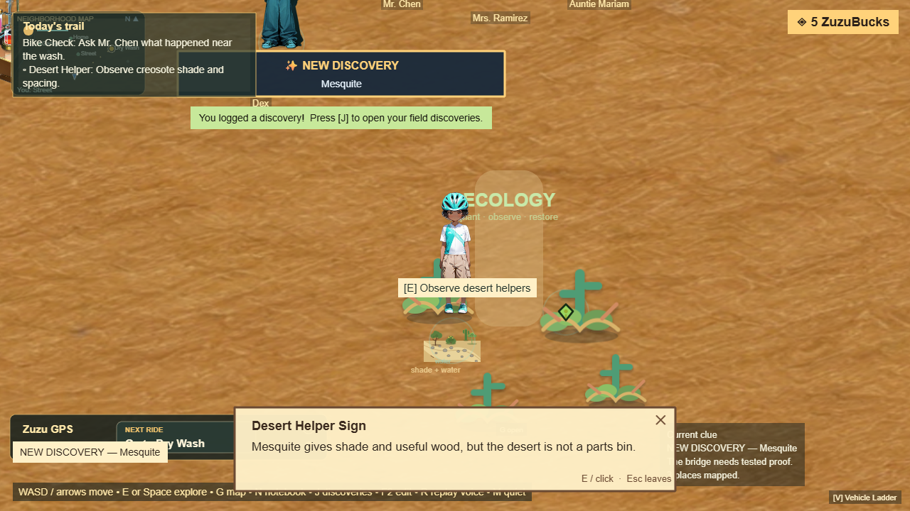
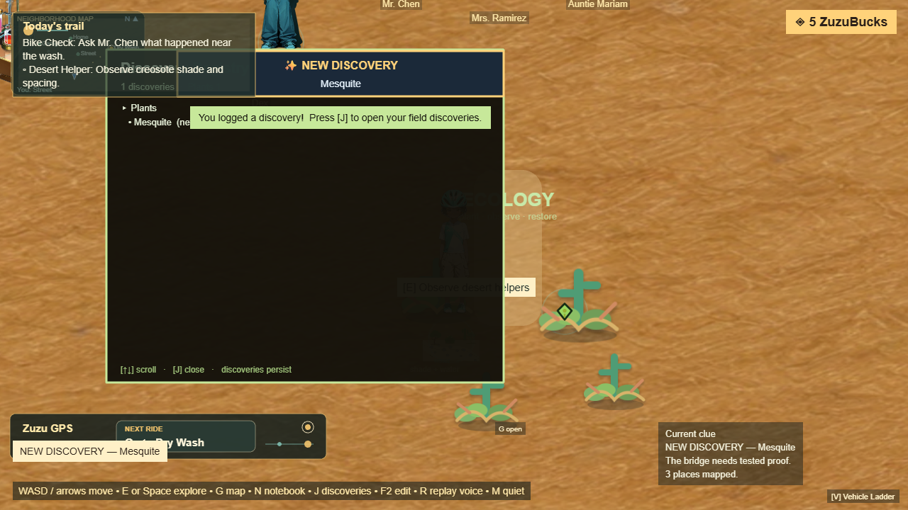

# Phase 2.2 — Discovery Registry

**Goal (owner):** everything discovered becomes persistent, across plants,
animals, materials, engineering concepts, investigations, NPC facts, language,
and landmarks. The player sees **NEW DISCOVERY** feedback. Discovery connects to
the notebook, ecology, investigations, and engineering. Held to the three-layer
standard (Engine + Player Reachability + Payoff).

## What shipped

- **`DiscoveryRegistrySystem`** — a persistent, categorised registry. `register({id,
  category, title, detail, source})` is idempotent (dedupes by id and reports
  `isNew` only on genuinely-new knowledge). 8 categories: `plant, animal,
  material, engineering, investigation, npc_fact, language, landmark`.
- **Connected to existing systems** (the registry is the connective tissue): the
  runtime registers discoveries from the actions the player already performs —
  `observeEcology` (plants, saguaro landmark), `testMaterial` (materials),
  `concludeMystery` (investigations + wash wildlife = animal), `designBridge`
  (engineering: safe load path), `resolveEcologyPlacement` (right-plant-right-place
  concept), `applyDialogueEffects` (language + NPC fact), `dry_wash`/`repairBridge`
  (landmarks). Each new discovery also flows through `recordFeedback`.
- **NEW DISCOVERY feedback** — a prominent center-top banner ("✨ NEW DISCOVERY —
  <title>") fires via a `discovery:new` event on each genuinely-new find.
- **Player-reachable registry view** — press **[J]** to open the Discovery
  Registry panel: discoveries grouped by category with counts, new ones flagged.
  Toggle to close (not a trap).
- **Persistence** — included in `getAct1State().discoveryRegistry` and
  `loadState`; survives save/load and page reload.
- `window.__DISCOVERY__` mirrors open/bannerVisible/total/categories/last for the
  reachability + payoff specs.

## Three-layer acceptance — all GREEN

| Layer | Spec / gate | Result |
|---|---|---|
| **Engine Acceptance** | `game-rebuild.discovery-engine.spec.js` | 1 passed — discoveries register across categories from real actions, duplicates don't double-count, registry persists across save/load |
| **Player Reachability** (primary) | `game-rebuild.discovery-reachability.spec.js` | 2 passed — by keyboard: a discovery through play shows NEW DISCOVERY + opens the [J] registry; discoveries persist across reload+load |
| **Payoff Acceptance** | strict-suite GUARD `a discovery through play shows NEW DISCOVERY and opens the registry ([J])` | passing — immediate banner payoff + persistent categorised registry, by keyboard |

Strict suite overall: **8 GUARDs green / 1 `fixme` skipped.** Engine acceptance
(full Act 1 walkthrough) green — no regression from the registry wiring.

## Screenshots

## Requirements check

- Everything discovered becomes persistent ✅ (save/load + reload verified)
- Tracks plants/animals/materials/engineering/investigations/NPC facts/language/landmarks ✅ (8 categories)
- Player sees NEW DISCOVERY feedback ✅ (banner)
- Connects to notebook/ecology/investigations/engineering ✅ (registered from those actions; notebook still updated in parallel)

## Next

**2.3 World Map** — functional (current / reachable / locked locations; no fake
destinations, no dead links), then 2.4 Multi-Biome.
