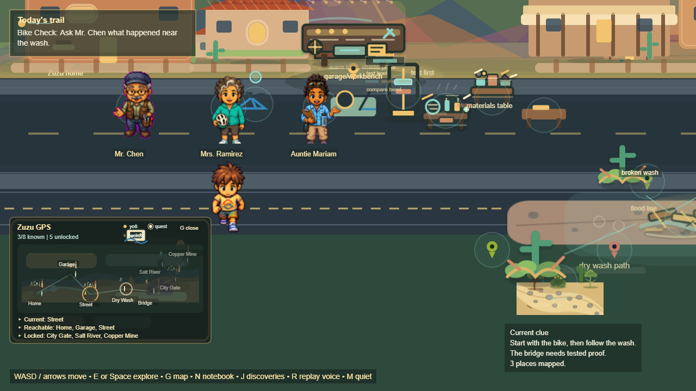

# Phase 2.3 — World Map (functional, not decorative)

**Goal (owner):** the world map must be functional. The player sees **Current
Location, Reachable Locations, Locked Locations** — no fake destinations, no dead
links. Held to the three-layer standard (Engine + Player Reachability + Payoff).

## What shipped

- **Single source of truth** — `act1WorldMapPoints` (data) owns the real
  destinations and their gating; `runtime.getWorldMap()` classifies every point
  into **Current / Reachable / Locked / undiscovered** from actual game state
  (discovery + wider-map unlock). The layout JSON keeps only pixel positions.
- **No fake destinations / no dead links** — the catalog is 8 real places
  (home, garage, street, dry_wash, bridge, wider_gate, salt_river, copper_mine).
  A place is *Reachable* only when it is genuinely known and open; locked places
  carry a stated unlock condition.
- **Functional progression** — the frontier (Salt River / Copper Mine / City
  Gate) is honestly **Locked** until the player repairs the bridge, then becomes
  **Reachable** (the wider map opens). Discovering the wash through play moves it
  into Reachable.
- **Fixed the "dead G key"** — there were *two* G handlers (a `keydown-G`
  listener and the update-loop `gpsJustPressed()`), so each press toggled the map
  twice (open+close) and it appeared dead. Removed the duplicate; **G now opens
  and closes** the map. Added **[J] discoveries** and **G map** to the on-screen
  controls hint.
- The expanded HUD now shows the three groups explicitly:
  `▸ Current: … / ▸ Reachable: … / ▸ Locked: …`. `window.__WORLDMAP__` mirrors
  current/reachable/locked/counts for the specs (published every frame, before
  any collapsed/expanded early-return).

## Three-layer acceptance — all GREEN

| Layer | Spec / gate | Result |
|---|---|---|
| **Engine Acceptance** | `game-rebuild.worldmap-engine.spec.js` | 1 passed — current/reachable/locked are real (no fake ids), discovery makes a place reachable, and the real repair→unlock chain promotes locked→reachable (locked frontier empties) |
| **Player Reachability** (primary) | `game-rebuild.worldmap-reachability.spec.js` | 2 passed — **G opens** a functional map (current ∈ reachable, neighborhood reachable, locked frontier shown) and **G closes** it; current is always a real place as the player moves |
| **Payoff Acceptance** | strict-suite GUARD `G opens a functional world map (current/reachable/locked) and closes` | passing — the G key is live and the map is functional, by keyboard |

Strict suite: **all GUARDs green** (Home, UTM predict, no-shadowed-zones, UTM
exit, bridge, investigation, ecology, discovery, **world map**) / 1 `fixme`.
Engine acceptance (full Act 1 walkthrough) green — no regression. (One UTM-guard
keyboard-nav flake during the combined run re-ran green standalone.)

## Screenshots

## Requirements check

- Functional, not decorative ✅ (states derived from real progression; G live)
- Current / Reachable / Locked shown ✅
- No fake destinations ✅ (catalog = real places; engine test asserts it)
- No dead links ✅ (Reachable only when known+open; locked carry unlock reasons)

## Next

**2.4 Multi-Biome** — no giant empty areas; each biome must contain
observation → prediction → outcome → payoff before expansion continues.
