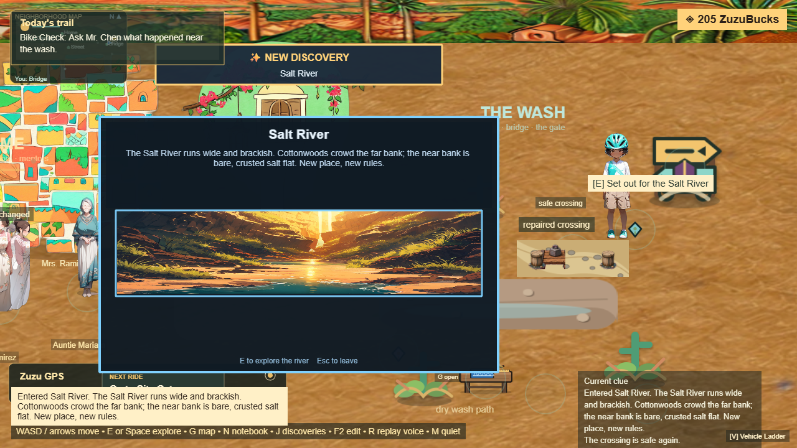
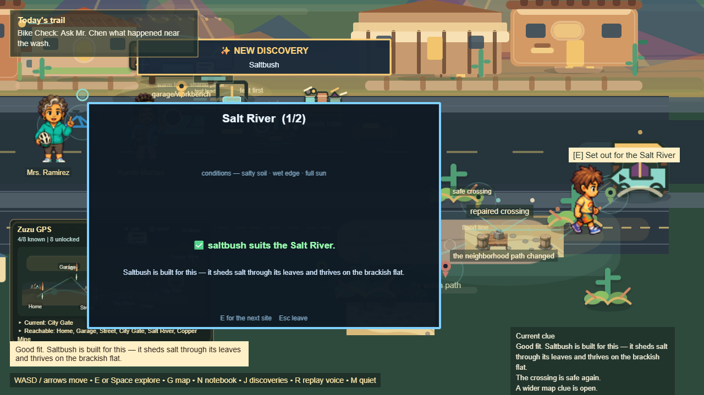
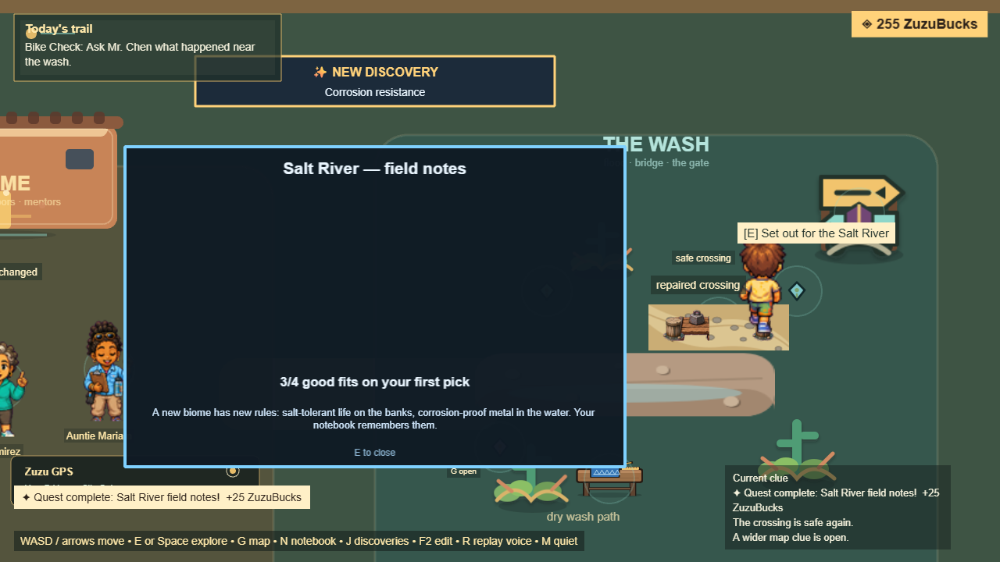

# Phase 2.4 — Multi-Biome (Salt River)

**Goal (owner):** do not build giant empty areas. Each biome must contain
**Observation → Prediction → Outcome → Payoff** before expansion continues.
Held to the three-layer standard (Engine + Player Reachability + Payoff).

## What shipped — one complete biome, not an empty area

**Salt River**, the first multi-biome region, reachable from a "Set out for the
Salt River" marker. It teaches that **a new place has new rules**:

- **Gated** behind the wider map — pressing the marker before the bridge is
  repaired opens a clear **locked panel** ("repair the bridge to open the route"),
  never silence. Once the wider map opens, the expedition runs the full loop.
- **Intro** — the biome's rules ("salt-tolerant life on the banks, fast
  corrosion for the wrong metal").
- **Site 1 — ecology (observe → predict → outcome → payoff):** which plant suits
  the brackish salt flat? **Saltbush** (sheds salt) thrives; cottonwood/mesquite
  don't. Payoff: why + a **saltbush** discovery.
- **Site 2 — engineering:** which material lasts in salt water? **Copper**
  (corrosion-resistant) lasts; steel rusts away. A wrong pick still teaches.
  Payoff: why + a **corrosion-resistance** discovery.
- **Payoff** — completing the biome registers the **Salt River landmark** +
  plant + concept discoveries (connects to 2.2) and the biome shows as a real
  destination once unlocked (2.3). Persists across save/load.

New code: `act1Biomes.js` (data), `BiomeSystem.js` (enter/observe/predict/resolve
+ per-placement progress), runtime gating (`enterBiome` checks the wider map),
`BiomeScene.js` overlay (intro/observe/predict/result/summary + blocked),
`window.__BIOME__` mirror, and a gated world marker. In `getAct1State` + save/load
+ debug API.

## Three-layer acceptance — all GREEN

| Layer | Spec / gate | Result |
|---|---|---|
| **Engine Acceptance** | `game-rebuild.biome-engine.spec.js` | 1 passed — locked until the real repair→unlock chain; full loop teaches (saltbush fits; steel rusts → copper); discoveries registered; persists save/load |
| **Player Reachability** (primary) | `game-rebuild.biome-reachability.spec.js` | 2 passed — locked gives a clear panel (never silent); after unlock, the full keyboard loop + payoff |
| **Payoff Acceptance** | strict-suite GUARD `a player runs the Salt River biome loop by hand — payoff delivered` | passing — biome completes through play + discoveries accrue |

Full gate: **11 passed / 1 skipped** (all 10 GUARDs green + engine acceptance;
the skip is the UTM `fixme`). Clean run, no flake.

## Screenshots

## Requirements check

- No giant empty areas ✅ (the biome is the loop; nothing decorative)
- Observation / Prediction / Outcome / Payoff ✅ (both sites)
- Reachable + gated honestly ✅ (locked panel, not silence; unlocks via the bridge)

## Phase 2 status

**2.1 Ecology Loop, 2.2 Discovery Registry, 2.3 World Map, 2.4 Multi-Biome are
all complete** to the three-layer standard. Per the execution order, this is the
**reassess** point — next targets (arc.md) await owner direction.
